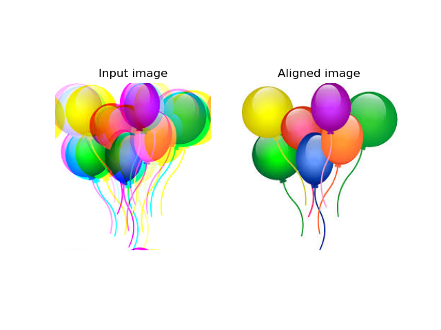
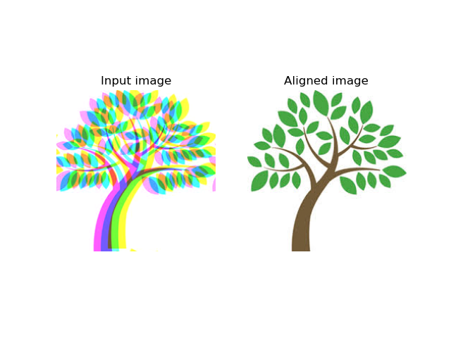
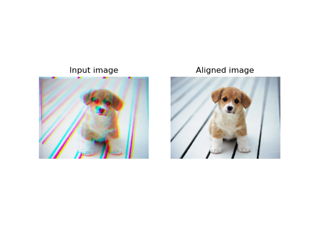
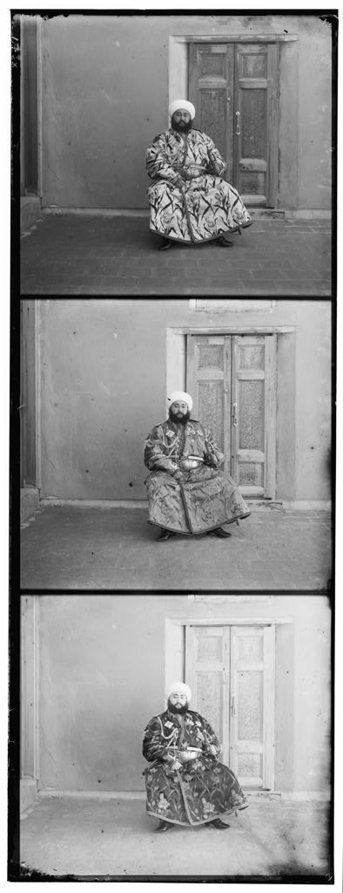
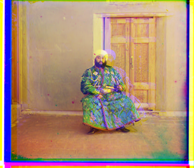

# Image-Alignment

## Background
Sergei Mikhailovich Prokudin-Gorskii (1863-1944) was a man well ahead of his time. Convinced, as early as
1907, that color photography was the wave of the future, he won Tzar’s special permission to travel across
the vast Russian Empire and take color photographs of everything he saw including the only color portrait
of Leo Tolstoy. And he really photographed everything: people, buildings, landscapes, railroads, bridges ...
thousands of color pictures! His idea was simple: record three exposures of every scene onto a glass plate
using a red, a green, and a blue filter. Never mind that there was no way to print color photographs until
much later – he envisioned special projectors to be installed in ”multimedia” classrooms all across Russia
where the children would be able to learn about their vast country. Alas, his plans never materialized: he
left Russia in 1918, right after the revolution, never to return again. Luckily, his RGB glass plate negatives,
capturing the last years of the Russian Empire, survived and were purchased in 1948 by the Library of
Congress. The LoC has recently digitized the negatives and made them available on-line

## Task
In this work, my goal is to take photographs of each plate and generate a color image by aligning them.
One way to align the plates is to exhaustively search over a window of possible displacements, 
score each one using some image matching metric, and take the displacement with the best score.
This method works because we expect the pixel intensity across R,G,B channels to be correlated.

## Toy Examples

## Sample Input and Output Image

Input: 

Output: 

